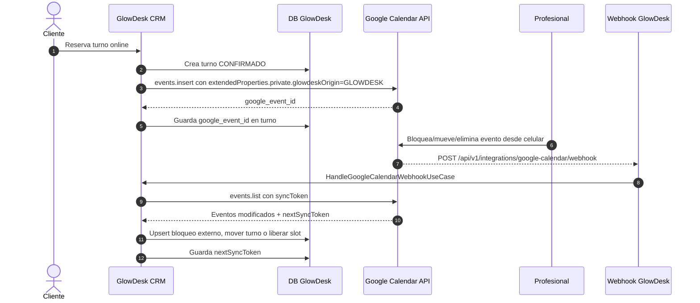

# Sincronizacion bidireccional Google Calendar

Modulo para GlowDesk en modo `INDEPENDENT`: un solo profesional, sin recepcion, donde el recurso bloqueante es su Google Calendar personal.

Fuentes oficiales usadas:

- Google Calendar Push Notifications: el webhook debe ser HTTPS, Google envia `POST` sin body y headers `X-Goog-*`; `X-Goog-Resource-State` puede ser `sync`, `exists` o `not_exists`; un cambio `exists` obliga a consultar la API para conocer el detalle. Fuente: https://developers.google.com/workspace/calendar/api/guides/push
- Google Calendar Events list: `syncToken` permite sincronizacion incremental; si expira, Google responde `410 Gone` y se debe limpiar estado local y hacer sincronizacion completa. Fuente: https://developers.google.com/workspace/calendar/api/v3/reference/events/list

## A. Arquitectura



## Estructura propuesta

```text
src/integrations/google-calendar/
  domain/
    GoogleCalendarSyncTypes.ts      # Entidades, DTOs, puertos
  application/
    HandleGoogleCalendarWebhookUseCase.ts
  http/
    googleCalendarWebhookController.ts

tests/integrations/google-calendar/
  HandleGoogleCalendarWebhookUseCase.test.ts
```

El SDK de Google, Prisma/Supabase y Express/Nest deben implementarse como adaptadores de infraestructura que cumplan los puertos `GoogleCalendarGateway`, `CalendarSyncAccountRepository` y `AgendaRepository`.

## B. Modelo de datos Prisma/PostgreSQL

```prisma
enum BusinessMode {
  INDEPENDENT
}

enum CalendarSyncOrigin {
  GLOWDESK
  GOOGLE
}

model GoogleCalendarIntegration {
  id                   String       @id @default(uuid()) @db.Uuid
  professionalId       String       @unique @db.Uuid
  businessMode          BusinessMode @default(INDEPENDENT)
  googleCalendarId      String       @default("primary")

  accessTokenEncrypted  String
  refreshTokenEncrypted String
  tokenExpiryDate       DateTime

  channelId             String       @unique
  webhookResourceId     String
  webhookChannelToken   String
  webhookExpiration     DateTime?
  syncToken             String?

  createdAt             DateTime     @default(now())
  updatedAt             DateTime     @updatedAt

  @@index([channelId, webhookResourceId])
}

model Appointment {
  id            String             @id @default(uuid()) @db.Uuid
  professionalId String            @db.Uuid
  clientId      String?            @db.Uuid
  googleEventId String?            @unique
  startAt       DateTime
  endAt         DateTime
  status        String
  syncOrigin    CalendarSyncOrigin @default(GLOWDESK)
  updatedAt     DateTime           @updatedAt
}

model AgendaBlock {
  id             String             @id @default(uuid()) @db.Uuid
  professionalId String             @db.Uuid
  googleEventId  String             @unique
  startAt        DateTime
  endAt          DateTime
  title          String
  source         String             @default("GOOGLE_CALENDAR")
  syncOrigin     CalendarSyncOrigin @default(GOOGLE)
  createdAt      DateTime           @default(now())
  updatedAt      DateTime           @updatedAt

  @@index([professionalId, startAt, endAt])
}
```

Seguridad:

- Guardar `accessTokenEncrypted` y `refreshTokenEncrypted`, nunca texto plano.
- El `X-Goog-Channel-Token` debe compararse contra `webhookChannelToken`.
- No enviar OAuth tokens en el token de canal.
- El endpoint debe ser HTTPS publico.

## Endpoint webhook

`POST /api/v1/integrations/google-calendar/webhook`

Google no envia body relevante. Headers usados:

```http
X-Goog-Channel-ID: channel-id
X-Goog-Channel-Token: signed-channel-token
X-Goog-Channel-Expiration: Tue, 19 Nov 2013 01:13:52 GMT
X-Goog-Resource-ID: resource-id
X-Goog-Resource-URI: https://www.googleapis.com/calendar/v3/calendars/primary/events
X-Goog-Resource-State: sync | exists | not_exists
X-Goog-Message-Number: 2
X-Goog-Changed: optional-resource-hint
```

Respuestas:

- `204`: notificacion aceptada.
- `400`: faltan headers obligatorios.
- `403`: canal desconocido o token invalido.

## C. Reglas de sincronizacion

- CRM -> Google: crear evento con `extendedProperties.private`:
  - `glowdeskAppointmentId`
  - `glowdeskOrigin=GLOWDESK`
- Google -> CRM:
  - `sync`: aceptar e ignorar.
  - `exists`: llamar `events.list` con `syncToken`.
  - evento externo confirmado en slot libre: crear `AgendaBlock`.
  - evento externo cancelado: eliminar bloqueo o cancelar turno asociado.
  - evento asociado a turno GlowDesk: mover/cancelar turno local.
  - evento con `glowdeskOrigin=GLOWDESK`: ignorar para evitar bucle infinito.
- Si Google responde `410 Gone`, limpiar `syncToken` y ejecutar full sync controlado.

## D. Testing

Criterio Gherkin implementado en Jest:

```gherkin
Escenario: Profesional bloquea horario en su celular y el CRM se actualiza
  Dado que el webhook recibe una notificacion "exists" de Google Calendar
  Cuando el caso de uso procesa el evento externo en un horario libre
  Entonces el sistema debe registrar un bloqueo de agenda en la base de datos de GlowDesk
```

Archivo: `tests/integrations/google-calendar/HandleGoogleCalendarWebhookUseCase.test.ts`
